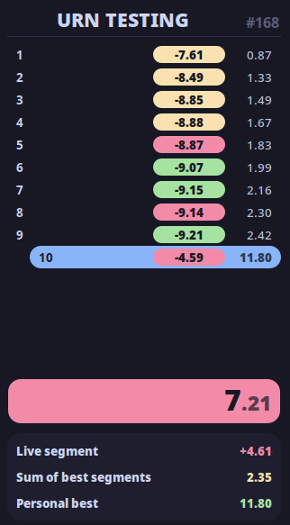
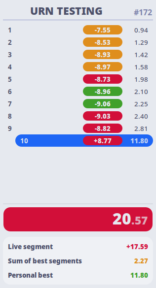

# Catppuccin Urn
[Catppuccin](https://github.com/catppuccin) Line of themes for [Urn.](https://github.com/paoloose/urn)
| Mocha | Macchiato | Frappé | Latte |
|---------|---------|---------|---------|
|  |  |  |  |

---
## Installation
- Clone Git repo
```
git clone https://gitlab.com/AsahiNyan/Catppuccin-Urn-Gtk
cd Catppuccin-Urn-Gtk
```
- Make install script executable
```
chmod +x install.sh
```
- Clean Urn default CSS
```
./install.sh --clean-css
```
- Install theme/s (`-h` for help)
```
./install.sh --[variant/all]
```

---
### Note
This is **NOT** a official Catppuccin theme, and is simply a thing i enjoyed making.
